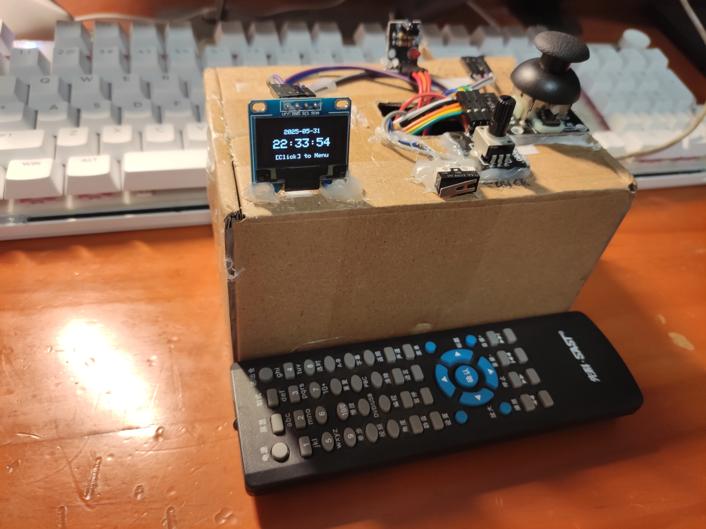

# Skid Clock



还在为水课发愁吗? 试试这款桌面时钟, 有一个 ESP32 就可以制作, 轻松跳过水课!

## 引脚信息

| 说明     | 引脚 | 额外说明        |
| -------- | ---- | --------------- |
| OLED SDA | 32   | 屏幕            |
| OLED SCL | 25   |                 |
| RTC CLK  | 4    | SSD1306时钟模块 |
| RTC DAT  | 16   |                 |
| RTC RST  | 17   |                 |
| JOY VRX  | 35   | 摇杆X坐标       |
| JOY VRY  | 33   | 摇杆Y坐标       |
| JOY SW   | 27   | 摇杆中键        |
| BTN      | 26   | 返回按钮        |
| POT      | 34   | 变阻器          |

## 物品清单

- ESP32 (或其他开发板)
- 摇杆
- SSD1306模块
- 0.96 寸 I2C OLED 显示屏
- 微动开关 (可替换成按钮)
- 变阻器
- 纸盒子 (可选)

## 功能

- 基础时钟功能, 包括显示时间/日期/倒计时/正计时
- NTP 同步时间
- 支持调整日期和时间
- 番茄钟
- 小猫桌宠
- 计算器
- Wi-Fi 连接支持
- [Lobsters 新闻](https://lobste.rs)阅读器
- [一些小游戏](#内置游戏列表)

### 内置游戏列表

- 贪吃蛇
- 五子棋
- 2048
- 谷歌小恐龙 (Dino run)
- 打砖块
- 堆叠叠罗汉 (Tower Bloxx)
- 简易版战舰棋 (Naval Battle)
- 打靶
- Free The Key
- 坦克动荡
- 俄罗斯方块
- 3D 跑酷 (实验性)
- 3D 赛车 (实验性)
- 黄金矿工
- 全民打飞机
- 吃豆人

## 刷写固件

```shell
pio run -t upload
```

## License

This project is licensed under GPL-3.0

You're allowed to use, share and modify
